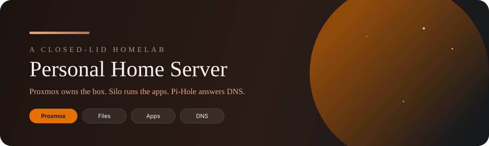
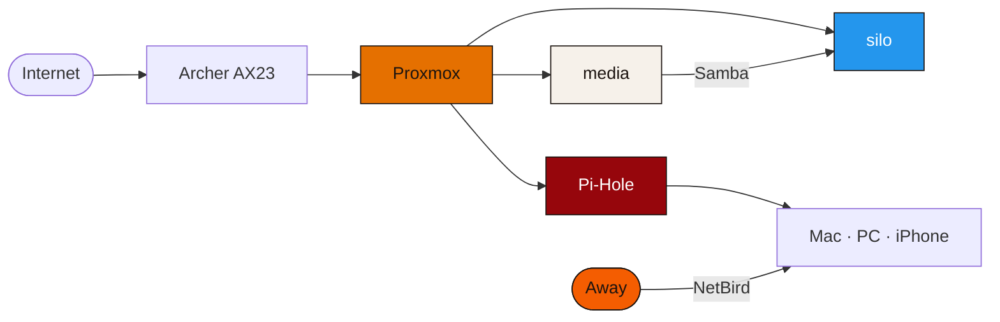

<p align="center">
  
</p>

<p align="center">
  <a href="https://app.notion.com/p/33fd9090f65d806aa174ee4efb92ef08"></a>
  
  
</p>

<p align="center">
  
  
  
  
  
</p>

<p align="center">
A closed-lid Acer laptop turned into a home server.<br>
It stores the files, plays the movies and music, blocks ads, and stays reachable away from home.
</p>

---

## Four rooms

<table>
<tr>
<td width="25%" valign="top">

### Proxmox
**Hypervisor** · VE 9.2

Runs the laptop and the guests.

`pve-homeserver.local` · port `8006`

</td>
<td width="25%" valign="top">

### media
**Files** · LXC `144`

Holds the library and shares it.

Mac and Windows both write here.

</td>
<td width="25%" valign="top">

### silo
**Apps** · VM `101`

Ubuntu Server 26.04, kernel 7.0.0-34. Docker 29.8 runs every app.

64 GB · 2 cores · 4 GB RAM.

</td>
<td width="25%" valign="top">

### Pi-Hole
**DNS** · LXC `102`

Pi-hole v6 with Unbound. Blocks ads for the whole house.

1 core · 512 MB RAM · 8 GB disk.

</td>
</tr>
</table>

The router is a TP-Link Archer AX23. Silo has the Intel iGPU passed through and OpenSSH on. Tabby on the Mac and the Windows PC has an SSH profile for it.



---

## What is running

Docker Compose on Silo, user and group `1000`. Heimdall is the front door. NetBird opens the rest of the house from away, including the Proxmox UI, so those admin pages stay off the public internet.

### Infrastructure

| Service | Where | What it does |
| --- | --- | --- |
| Proxmox VE 9.2 | host | Runs the guests · `8006` |
| Samba + wsdd | media | Shares the files · `445` |
| Pi-Hole v6 | LXC 102 | Blocks ads · Core 6.4.3 · Web 6.6 · FTL 6.7.1 · `80/admin` |
| Unbound | inside Pi-Hole | Resolves DNS · `5335` on localhost |
| Nginx Proxy Manager | Silo | HTTPS names · `81` |
| DuckDNS updater | container | Keeps the public name current |
| Portainer CE | `/docker/portainer` | Docker UI · `9000` |
| Uptime Kuma | `/docker/uptimekuma` | Watches what is up · `3001` |
| Heimdall | Silo | Dashboard for the apps |
| Vaultwarden | `/docker/vaultwarden` | Password vault · `8080` |

### Entertainment

| Service | Where | What it does |
| --- | --- | --- |
| Jellyfin | `/docker/jellyfin` | Movies and TV · `8096` |
| Navidrome | `/docker/navidrome` | Music · `4533` |
| Jellyseerr | `/docker/servarr` | Request new titles · `5055` |

Jellyfin’s server name is **Silo Server**. Libraries are `/data/movies` and `/data/shows`, transcoded with Intel Quick Sync. Navidrome plays `/data/music`.

### Photos

| Service | Where | What it does |
| --- | --- | --- |
| Immich | Silo | Photo library · `2283` |

Immich v3.2.2 keeps its database, cache, and machine-learning containers beside the server. Pictures live in `/data/photos`. On this two-core VM it can take about fifteen minutes after boot before the server is healthy.

### The Engines

These organize the library. They live in `/docker/servarr`. Downloads stay off until a VPN subscription exists. Bazarr covers English, Bulgarian, and Greek.

| Service | Port | What it does |
| --- | --- | --- |
| Prowlarr | `9696` | Finds indexers |
| Sonarr | `8989` | Tracks TV |
| Radarr | `7878` | Tracks movies |
| Lidarr | `8686` | Tracks music |
| Bazarr | `6767` | Fetches subtitles |

### Waiting

| Service | Waiting on |
| --- | --- |
| qBittorrent | A VPN subscription, then it sits behind Gluetun |
| Gluetun | Same subscription. Proton VPN, Mullvad, or AirVPN |
| Nextcloud | A hardware upgrade |
| WireGuard | NetBird already covers remote access |

---

## Names

`silo-vault.duckdns.org` is the public name. An updater keeps it current.

| Hostname | Lands on |
| --- | --- |
| `silo-vault.duckdns.org` | Heimdall |
| `jellyfin.`… | Jellyfin |
| `jellyseerr.`… | Jellyseerr |
| `navidrome.`… and `music.`… | Navidrome |
| `vault.`… | Vaultwarden |

Each name is a subdomain of `silo-vault.duckdns.org`. Pi-Hole, with Unbound behind it, is the DNS for the router, the Mac, the Windows PC, and the iPhone.

---

## The box

<table>
<tr>
<td width="25%" align="center"><strong>CPU</strong><br>i3-4030U<br>2 cores / 4 threads</td>
<td width="25%" align="center"><strong>RAM</strong><br>12 GB<br>4 GB + 8 GB</td>
<td width="25%" align="center"><strong>Disks</strong><br>2× 1 TB HDD</td>
<td width="25%" align="center"><strong>Graphics</strong><br>HD 4400 in Silo<br>plus a GeForce 820M</td>
</tr>
</table>

The lid stays closed and the machine keeps running. The Intel graphics inside Silo do the transcoding.

| Volume | Holds |
| --- | --- |
| 1 TB HGST | Proxmox, VM disks, container roots |
| 1 TB second HDD | Media, as `mainstorage-hdd` |

| Mount | Size | Path |
| --- | --- | --- |
| Root | 64 GB | `/` |
| Media | 800 GB | `/data` |
| Docker | 32 GB | `/docker` |

Silo and Pi-Hole can be snapshotted. Media cannot, because `/data` is directory storage on `mainstorage-hdd`.

Silo mounts the media share at `/data` and runs Compose from its own `/docker`. Jellyfin, Navidrome, Sonarr, Radarr, Lidarr, Bazarr, and Immich all bind that path. On 16 Sep 2026 the share was unavailable while Docker created those containers, so they stayed stopped. On 25 Sep the share was healthy again, `docker start` brought them back, and Uptime Kuma returned to green. On 26 Sep the guests and the host were updated, then the host rebooted. The share was still mounted, so the library apps came back on their own.

```text
/data
├── movies
├── shows
├── music
├── books
├── photos
├── games
├── youtube
└── downloads
```

Samba exports `[data]` and `[docker]`. Guest access is off.

---

## How it got here

<table>
<tr>
<td width="20%" align="center" valign="top"><strong>25–27 Apr</strong><br>The box</td>
<td width="20%" align="center" valign="top"><strong>29–30 Apr</strong><br>Silo & Jellyfin</td>
<td width="20%" align="center" valign="top"><strong>2–4 May</strong><br>Music & DNS</td>
<td width="20%" align="center" valign="top"><strong>5–7 May</strong><br>The public door</td>
<td width="20%" align="center" valign="top"><strong>8 May</strong><br>NetBird</td>
</tr>
<tr>
<td valign="top">Swapped in the disks and RAM. Installed Proxmox. Made the lid stay awake. Added the second disk, then the media container and Samba. Mac and Windows could read and write.</td>
<td valign="top">Installed Ubuntu on Silo. Added Docker and passed the Intel GPU through. Mounted the file share. Jellyfin came up with hardware transcoding, and the movies went on.</td>
<td valign="top">Navidrome took the music. Pi-Hole and Unbound became the house DNS. Grew the media disk to 800 GB. Added Portainer and Uptime Kuma.</td>
<td valign="top">Servarr went up without a download client. Nginx and DuckDNS published the names. Heimdall and Vaultwarden followed. Checked it from a phone off Wi-Fi.</td>
<td valign="top">Joined Proxmox, Silo, the iPhone, and the MacBook to NetBird. A route to the house LAN made the usual services work from away.</td>
</tr>
</table>

In September the library apps were restored after a dead file share, then Silo, media, Pi-hole, and Proxmox were brought up to date. NetBird on the host and on Silo is 0.79.0.

---

## Still open

- [ ] qBittorrent and Gluetun, after a VPN subscription
- [ ] Upload photos and videos into Immich
- [ ] Nextcloud, after a hardware upgrade
- [ ] WireGuard. NetBird already does remote access
- [ ] Tabby config sync, Mac and Windows
- [ ] Jellyfin iPhone app

---

<p align="center">
The lid stays down. The library stays up.
</p>
